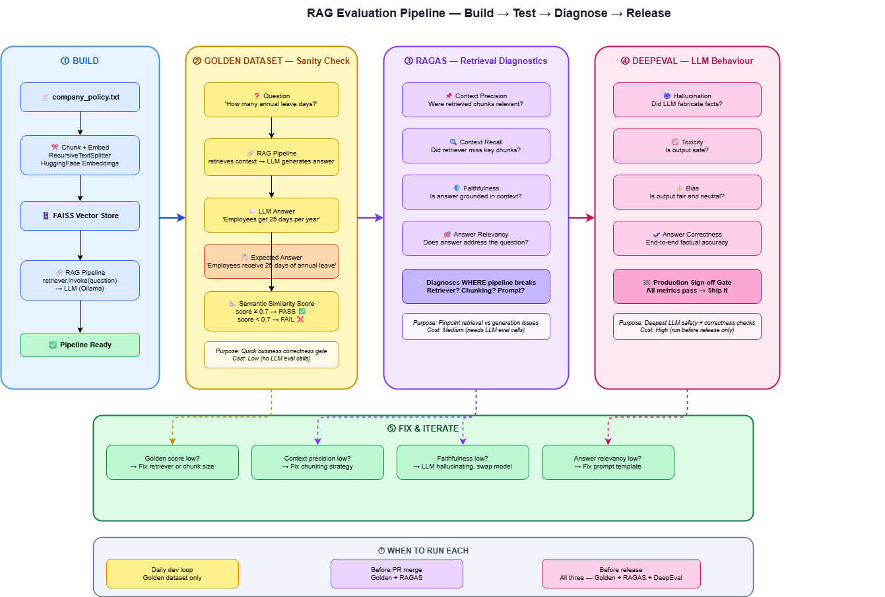

<p align="center">
  
</p>

<h1 align="center">✦ Golden Dataset Studio</h1>

<p align="center">
  <strong>A production-grade RAG evaluation framework built around a curated golden dataset core.</strong><br/>
  Hand-crafted ground truth &nbsp;·&nbsp; Versioned Q&A pairs &nbsp;·&nbsp; Semantic similarity scoring &nbsp;·&nbsp; RAGAS + DeepEval integration
</p>

<p align="center">
  
  
  
  
  
  
</p>

---

## What is Golden Dataset Studio?

Most RAG evaluation frameworks treat the golden dataset as an afterthought — a CSV you import once and forget. **Golden Dataset Studio flips that.** The golden dataset is the foundation everything else is built on.

A **golden dataset** is a hand-curated set of question + expected answer pairs specific to *your* domain and *your* documents. Every entry is something a human has verified is correct. It is your ground truth — the one thing you trust completely when your model changes, your chunking strategy changes, or your LLM is swapped.

```
Without a golden dataset:     you are guessing whether your RAG works
With a golden dataset:        you know — precisely, repeatably, with a version history
```

Golden Dataset Studio gives you:
- A **versioned store** for your Q&A pairs (`v1.0` → `v1.3` → ...)
- A **semantic similarity scorer** that compares LLM answers against expected answers
- A **manifest system** that tracks which version was evaluated with which model
- A **clean eval runner** that strips noise (model tags, markdown) before scoring
- Integration hooks for **RAGAS** and **DeepEval** when you need deeper diagnostics

---

## The Three-Layer Evaluation Strategy

```
                    ┌─────────────────────────────────────────────────────┐
                    │             GOLDEN DATASET STUDIO                   │
                    │                                                     │
                    │  "Is the final answer CORRECT for my domain?"      │
                    │                                                     │
                    │  Hand-curated Q&A  ·  Versioned  ·  Fast  ·  Cheap │
                    └─────────────────┬───────────────────────────────────┘
                                      │ PASS
                                      ▼
                    ┌─────────────────────────────────────────────────────┐
                    │                    RAGAS                            │
                    │                                                     │
                    │  "WHY is the pipeline producing that answer?"      │
                    │                                                     │
                    │  Context Precision · Context Recall · Faithfulness  │
                    └─────────────────┬───────────────────────────────────┘
                                      │ PASS
                                      ▼
                    ┌─────────────────────────────────────────────────────┐
                    │                  DEEPEVAL                           │
                    │                                                     │
                    │  "Is the LLM safe to ship to users?"               │
                    │                                                     │
                    │  Hallucination · Toxicity · Bias · Correctness     │
                    └─────────────────────────────────────────────────────┘
```

> **If Golden Dataset fails badly — stop here. Fix the retriever or chunking first. Do not burn RAGAS/DeepEval credits diagnosing a broken pipeline.**

---

## Golden Dataset — Deep Dive

### What goes into it

Each entry has three fields:

```json
{
  "id": "b9e08070",
  "question": "How many annual leave days do employees get?",
  "answer": "Employees receive 25 days of annual leave per year."
}
```

The `answer` is what a human expert wrote after reading your source document. It is not generated by an LLM. It is not scraped. It is your authoritative ground truth.

### How scoring works

```
LLM answer  ──► sentence-transformers ──► embedding vector ──┐
                                                              ├──► cosine similarity ──► score
Expected answer ──► sentence-transformers ──► embedding vector ──┘

score >= 0.7  →  PASS ✓
score <  0.7  →  FAIL ✗
```

We use `sentence-transformers/all-MiniLM-L6-v2` for embeddings. Semantic similarity means **paraphrases pass** — the LLM doesn't need to match word-for-word.

### The clean_answer step

Before scoring, LLM output is cleaned to remove noise that tanks similarity scores unfairly:

```python
def clean_answer(answer: str) -> str:
    # Remove [Model: gpt-oss:20b] prefix injected for traceability
    answer = re.sub(r'^\[Model:[^\]]+\]\s*', '', answer.strip())
    # Remove markdown bold **...**
    answer = re.sub(r'\*{1,2}([^*]+)\*{1,2}', r'\1', answer)
    return answer.strip()
```

Without this, `[Model: gpt-oss:20b] **25 annual leave days**` scores `0.46` against the expected answer. After cleaning, the same answer scores `0.93`.

### Versioning

Every eval run is saved with the dataset version and model name:

```
evals/
  eval_v1.3_20250610_143022.json   ← which version, which timestamp
my_answers.json                    ← { "model": "gpt-oss:20b", "answers_raw": [...], "answers_clean": [...] }
```

This means you can re-evaluate old answers against a new dataset version without re-running the LLM.

---

## RAGAS — Retrieval Diagnostics

Run after Golden Dataset passes. Answers *where* the pipeline is breaking.

| Metric | Question it answers |
|---|---|
| **Context Precision** | Were the retrieved chunks relevant to the question? |
| **Context Recall** | Did the retriever miss any important information? |
| **Faithfulness** | Is the LLM answer grounded in the retrieved context, or hallucinated? |
| **Answer Relevancy** | Does the answer actually address what was asked? |

A real debugging scenario:

```
LLM answers "25 days"  ✓  Golden Dataset PASSES

But Context Precision = 0.3  ✗

Meaning: the retriever fetched 5 chunks, only 1 was relevant.
The LLM got lucky. Fix: reduce chunk_size, tune similarity threshold.
```

---

## DeepEval — LLM Behaviour Gate

Run before every production release. The final sign-off check.

| Metric | What it catches |
|---|---|
| **Hallucination** | LLM fabricating facts not present in retrieved context |
| **Toxicity** | Unsafe or harmful output |
| **Bias** | Unfair or skewed responses |
| **Answer Correctness** | End-to-end factual accuracy across all questions |

---

## When to Run Each Layer

| Trigger | Layers to run | Reason |
|---|---|---|
| Every code change / daily dev | Golden Dataset only | Fast, free, catches regressions immediately |
| Before merging a PR | Golden Dataset + RAGAS | Ensures retrieval quality didn't degrade |
| Before a production release | All three | Full sign-off — correctness, retrieval, safety |

---

## Quick Start

```bash
git clone https://github.com/your-username/golden-dataset-studio.git
cd golden-dataset-studio

pip install -r requirements.txt

# Run the golden dataset evaluation
python run_golden_eval.py --llm gpt-oss:20b

# Default model (llama3.2)
python run_golden_eval.py
```

---

## Sample Output

```
Model: gpt-oss:20b
Running RAG pipeline against 2 golden entries (v1.3)...

[1/2] Q: How many annual leave days?
         Model:    gpt-oss:20b
         A:        [Model: gpt-oss:20b] Employees are entitled to 25 annual leave days.
         Cleaned:  Employees are entitled to 25 annual leave days.
         Expected: Employees receive 25 days of annual leave per year.
         Latency:  36.95s

==================================================
EVALUATION RESULTS (v1.3)
Model: gpt-oss:20b
==================================================
  [b9e08070] ✓ similarity=0.923  Q: How many annual leave days?
  [f8aac4c1] ✓ similarity=0.941  Q: What is the notice period?

  Avg Similarity: 0.932
  Pass (>=0.7):   ✓
  Saved to:       evals/eval_v1.3_20250610_143022.json
```

---

## Project Structure

```
golden-dataset-studio/
├── data/
│   └── company_policy.txt          # Source document
├── golden_dataset.py               # DatasetStore, Evaluator, EvalResult, Manifest
├── run_golden_eval.py              # Eval runner — RAG + scoring + clean_answer
├── my_answers.json                 # { model, answers_raw, answers_clean }
├── evals/                          # Versioned eval results
│   └── eval_v1.3_<timestamp>.json
├── architecture.png                # Pipeline diagram
└── requirements.txt
```

---

## Troubleshooting

| Symptom | Root cause | Fix |
|---|---|---|
| Similarity score ~0.46 despite correct answer | Model tag or markdown `**...**` in LLM output polluting embedding | `clean_answer()` strips both before scoring |
| `invalid model name (status code: 400)` | Wrong Ollama model name format | Use `gpt-oss:20b` not `gpt:oss:20b` |
| Context precision low | Chunks too large, retriever fetching noise | Reduce `chunk_size`, tune retriever `k` |
| Faithfulness low | LLM hallucinating beyond retrieved context | Tighten prompt, try different model |
| Answer relevancy low | Prompt not focused enough | Refine the prompt template |

---

## Tech Stack

| Layer | Technology |
|---|---|
| Document loading | LangChain `TextLoader` |
| Chunking | `RecursiveCharacterTextSplitter` |
| Embeddings | `sentence-transformers/all-MiniLM-L6-v2` |
| Vector store | FAISS |
| LLM inference | Ollama (local) — `gpt-oss:20b`, `llama3.2` |
| RAG orchestration | LangChain |
| Retrieval evaluation | RAGAS |
| LLM evaluation | DeepEval |
| Observability | Langfuse |

---

## Roadmap

- [ ] RAGAS metrics wired into the main eval runner
- [ ] DeepEval hallucination checks per golden entry
- [ ] Langfuse trace per eval run
- [ ] Multi-model comparison mode (`--llm-compare llama3.2,gpt-oss:20b`)
- [ ] CI/CD gate — fail pipeline if avg similarity < 0.7
- [ ] Streamlit dashboard for visualising eval history across versions

---

## License

MIT